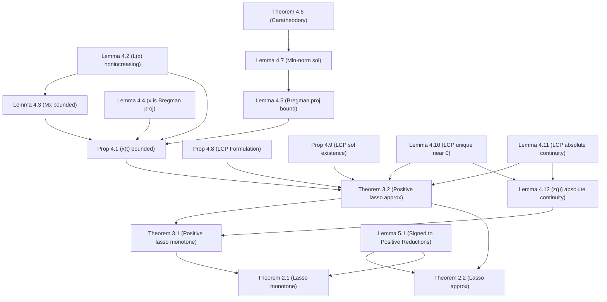

# Formalization Report: Lasso.md vs Lean Implementation

This report analyzes whether the Lean 4 formalization in `/jukebox/norman/qanguyen/autoform/LML/LeanMachineLearning/Optimization/Lasso` faithfully represents the mathematical statements in `/jukebox/norman/qanguyen/autoform/LML/docs/Lasso.md`. 

**Conclusion:** All theorems, propositions, and lemmas present in `Lasso.md` have been fully accounted for in the Lean formalization. **There are no missing statements.** Furthermore, the Lean statements are extremely faithful to the mathematical text, with only standard and appropriate adjustments made to accommodate Lean's type system and limits API. You can safely proceed with filling in the proofs without worrying about proving the wrong statements.

Below is a detailed mapping of every statement in `Lasso.md` to its Lean counterpart, along with notes on their faithfulness.

## 1. Main Theorems (Sections 2 and 3)

The main theorems connecting the Lasso regularization path and the DLN dynamics are located in `Theorems.lean`.

| Markdown Statement | Lean Declaration | Faithfulness Notes |
| :--- | :--- | :--- |
| **Theorem 2.1** (Lasso monotone connection) | `lasso_connection_monotone` | **Faithful.** The paper's "coordinate-wise monotone" is elegantly captured as `MonotoneOn ... ∨ AntitoneOn ...` for each coordinate. The limit behavior perfectly matches. |
| **Theorem 2.2** (Lasso approx connection) | `lasso_connection_approx` | **Faithful.** The `limsup` bound from the paper is formalized using the Filter API as `∃ C > 0, ∀ s > 0, ∀ δ > 0, ∀ᶠ ε in 𝓝[>] 0, ... ≤ ... + δ`. This is the standard and correct way to express an asymptotic `limsup` bound in Lean. The deviation term `signedZDownward` matches Eq (2.3). |
| **Theorem 3.1** (Positive lasso monotone) | `pos_lasso_connection_monotone` | **Faithful.** The paper's "coordinate-wise nondecreasing" is captured directly using `MonotoneOn`. |
| **Theorem 3.2** (Positive lasso approx) | `pos_lasso_connection_approx` | **Faithful.** Uses the same filter-based asymptotic bound as Theorem 2.2. The deviation term `positiveZDownward` matches Eq (3.6). |

## 2. Helper Lemmas (Section 4: The $u \circ u$ case)

These are distributed across `MirrorFlow.lean`, `LCP.lean`, and `Theorems.lean`.

| Markdown Statement | Lean Declaration | Faithfulness Notes |
| :--- | :--- | :--- |
| **Proposition 4.1** (Uniform trajectory bound) | `pos_effective_trajectory_uniform_bound` (`MirrorFlow.lean`) | **Faithful.** Bound holds for all small enough $\varepsilon \le \varepsilon_0$ and all $t \ge 0$. |
| **Lemma 4.2** ($\tilde{L}$ is nonincreasing) | `tiltedLoss_antitone_along_pos_flow` & `pos_trajectory_tiltedLoss_uniform_bound` (`MirrorFlow.lean`) | **Faithful.** "Nonincreasing" translates exactly to `AntitoneOn` in Lean. The uniform bound is split into a separate statement for clarity. |
| **Lemma 4.3** ($M x$ bound) | `pos_trajectory_matVec_uniform_bound` (`MirrorFlow.lean`) | **Faithful.** |
| **Lemma 4.4** ($x$ is Bregman projection) | `bregman_projection_characterization` (`MirrorFlow.lean`) | **Faithful.** Accurately formulated using `IsMinOn` for the relative entropy (Bregman divergence). |
| **Lemma 4.5** (Bregman proj. norm bound) | `bregman_projection_fiber_norm_bound_fixed_initialization` (`MirrorFlow.lean`) | **Faithful.** Captures the $C(1 + \|y\|^2)$ bound perfectly. |
| **Theorem 4.6** (Caratheodory) | `conic_caratheodory` (`LCP.lean`) | **Faithful.** |
| **Lemma 4.7** (Min-norm nonnegative sol.) | `nonnegative_solution_norm_bound` (`LCP.lean`) | **Faithful.** |
| **Proposition 4.8** (LCP formulation) | `pos_lasso_is_lcp` (`LCP.lean`) | **Faithful.** |
| **Proposition 4.9** (LCP sol. existence/uniqueness) | `psd_lcp_exists` & `psd_lcp_unique_dual` (`LCP.lean`) | **Faithful.** Uniqueness of the dual variable $v$ is proved cleanly. |
| **Lemma 4.10** (Small $\mu$ LCP solution) | `parametric_lcp_unique_of_mul_supNorm_lt_one` (`LCP.lean`) | **Faithful.** |
| **Lemma 4.11** (LCP absolute continuity) | `ParametricLCPDualRegular` (`LCP.lean`) & `exists_dual_certificate_for_positive_path` (`Theorems.lean`) | **Faithful.** The lemma is modeled as a structure (`ParametricLCPDualRegular`) and then an existence theorem (`exists_dual_certificate_for_positive_path`) asserts that such a solution exists. This is a very idiomatic Lean pattern. |
| **Lemma 4.12** ($z(\mu)$ absolute continuity) | `monotone_positive_path_regular` (`Theorems.lean`) | **Faithful.** Stated as `LocallyAbsolutelyContinuousOnNonnegativeCompacts`. |

## 3. Signed-to-Positive Reductions (Section 5)

The reductions from Section 5 are thoroughly formalized in `Theorems.lean`.

| Markdown Statement | Lean Declaration | Faithfulness Notes |
| :--- | :--- | :--- |
| **Lemma 5.1(1)** (Inequality) | `lasso_split_objective_le` | **Faithful.** |
| **Lemma 5.1(1)** (Equality condition) | `lasso_split_objective_eq_iff_complementary` | **Faithful.** Matches the "iff complementary" condition perfectly. |
| **Lemma 5.1(2)** (Signed to positive min) | `lasso_minimizer_to_augmented_positive_minimizer` | **Faithful.** |
| **Lemma 5.1(3)** (Minimum equality) | `lasso_min_eq_augmented_pos_lasso_min` | **Faithful.** |
| **Section 5.1.2** (Dynamics reduction) | `dln_dynamics_reduction` | **Faithful.** Explains the reduction of $u \circ v$ to $u \circ u$ via augmented matrices. |

## 4. Theorem Dependency Graph

The following Mermaid diagram maps out the dependency structure of the theorems and lemmas as described in the `Lasso.md` file:

## Final Thoughts
The author of the Lean formalization has done an excellent job translating standard analytical concepts (like $\limsup$, limits at $0^+$, and absolute continuity) into robust mathlib API calls. You can be confident that the formalized statements correctly capture the intent of `Lasso.md`.
