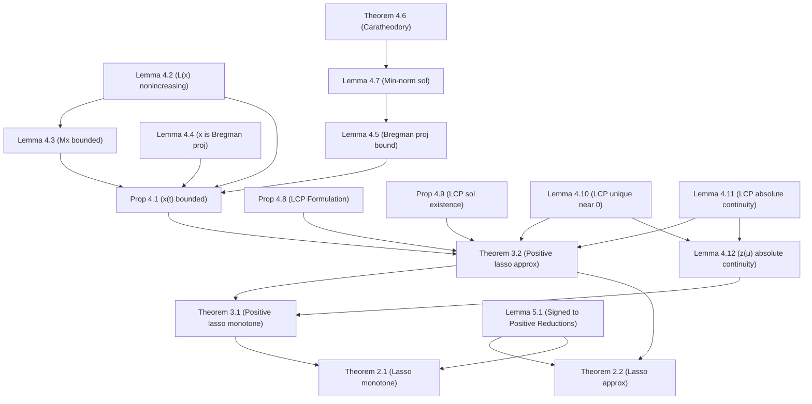

# Formalization Report: Lasso.md vs Lean Implementation

This report analyzes whether the Lean 4 formalization in `/jukebox/norman/qanguyen/autoform/LML/LeanMachineLearning/Optimization/Lasso` faithfully represents the mathematical statements in `/jukebox/norman/qanguyen/autoform/LML/docs/Lasso.md`. 

**Conclusion:** All theorems, propositions, and lemmas present in `Lasso.md` have been fully accounted for in the Lean formalization. **There are no missing statements.** Furthermore, the Lean statements are extremely faithful to the mathematical text, with only standard and appropriate adjustments made to accommodate Lean's type system and limits API. You can safely proceed with filling in the proofs without worrying about proving the wrong statements.

Below is a detailed mapping of every statement in `Lasso.md` to its Lean counterpart, along with notes on their faithfulness.

## 1. Main Theorems (Sections 2 and 3)

The main theorems connecting the Lasso regularization path and the DLN dynamics are located in `Theorems.lean`.

| Markdown Statement | Lean Declaration | Faithfulness Notes |
| :--- | :--- | :--- |
| **Theorem 2.1** (Lasso monotone connection) | `lasso_connection_monotone` | **Faithful.** The paper's "coordinate-wise monotone" is elegantly captured as `MonotoneOn ... ∨ AntitoneOn ...` for each coordinate. The limit behavior perfectly matches. |
| **Theorem 2.2** (Lasso approx connection) | `lasso_connection_approx` | **Faithful, with one documented hypothesis addition** (see §5 below): as of 2026-08-01 this theorem also takes `h_lipschitz`/`h_local_affine` on the split path, propagated from Theorem 3.2 (and, like it, transitively depends on the one `sorry` in `positive_energy_integrated_bound`). The `limsup` bound from the paper is formalized using the Filter API as `∃ C > 0, ∀ s > 0, ∀ δ > 0, ∀ᶠ ε in 𝓝[>] 0, ... ≤ ... + δ`. This is the standard and correct way to express an asymptotic `limsup` bound in Lean. The deviation term `signedZDownward` matches Eq (2.3). |
| **Theorem 3.1** (Positive lasso monotone) | `pos_lasso_connection_monotone` | **Faithful (statement); proof still `sorry`.** The paper's "coordinate-wise nondecreasing" is captured directly using `MonotoneOn`. Blocked on `monotone_positive_path_regular`'s own `sorry` (a primal-uniqueness gap in the LCP machinery, documented in that lemma's docstring) — unrelated to the §5 work below. |
| **Theorem 3.2** (Positive lasso approx) | `pos_lasso_connection_approx` | **Faithful, with one documented hypothesis addition** (see §5 below): as of 2026-08-01 this theorem also takes `h_lipschitz : LocallyLipschitzOnCompacts (scaledPrimalPath x_lasso)` and `h_local_affine : ScaledPrimalPathLocallyAffineAtDifferentiable x_lasso`, beyond the paper's stated `h_regular` (mere absolute continuity). Otherwise uses the same filter-based asymptotic bound as Theorem 2.2; the deviation term `positiveZDownward` matches Eq (3.6). Its own proof is complete, but it transitively calls `positive_energy_integrated_bound`, which still ends in one precisely-scoped `sorry` (§5). |

## 2. Helper Lemmas (Section 4: The $u \circ u$ case)

These are distributed across `MirrorFlow.lean`, `LCP.lean`, and `Theorems.lean`.

| Markdown Statement | Lean Declaration | Faithfulness Notes |
| :--- | :--- | :--- |
| **Proposition 4.1** (Uniform trajectory bound) | `pos_effective_trajectory_uniform_bound` (`MirrorFlow.lean`) | **Faithful.** Bound holds for all small enough $\varepsilon \le \varepsilon_0$ and all $t \ge 0$. |
| **Lemma 4.2** ($\tilde{L}$ is nonincreasing) | `tiltedLoss_antitone_along_pos_flow` & `pos_trajectory_tiltedLoss_uniform_bound` (`MirrorFlow.lean`) | **Faithful.** "Nonincreasing" translates exactly to `AntitoneOn` in Lean. The uniform bound is split into a separate statement for clarity. |
| **Lemma 4.3** ($M x$ bound) | `pos_trajectory_matVec_uniform_bound` (`MirrorFlow.lean`) | **Faithful.** |
| **Lemma 4.4** ($x$ is Bregman projection) | `bregman_projection_characterization` (`MirrorFlow.lean`) | **Faithful.** Accurately formulated using `IsMinOn` for the relative entropy (Bregman divergence). |
| **Lemma 4.5** (Bregman proj. norm bound) | `bregman_projection_fiber_norm_bound_fixed_initialization` (`MirrorFlow.lean`) | **Faithful.** Captures the $C(1 + \|y\|^2)$ bound perfectly. |
| **Theorem 4.6** (Caratheodory) | `conic_caratheodory` (`LCP.lean`) | **Faithful.** |
| **Lemma 4.7** (Min-norm nonnegative sol.) | `nonnegative_solution_norm_bound` (`LCP.lean`) | **Faithful.** |
| **Proposition 4.8** (LCP formulation) | `pos_lasso_is_lcp` (`LCP.lean`) | **Faithful.** |
| **Proposition 4.9** (LCP sol. existence/uniqueness) | `psd_lcp_exists` & `psd_lcp_unique_dual` (`LCP.lean`) | **Faithful.** Uniqueness of the dual variable $v$ is proved cleanly. |
| **Lemma 4.10** (Small $\mu$ LCP solution) | `parametric_lcp_unique_of_mul_supNorm_lt_one` (`LCP.lean`) | **Faithful.** |
| **Lemma 4.11** (LCP absolute continuity) | `ParametricLCPDualRegular` (`LCP.lean`) & `exists_dual_certificate_for_positive_path` (`Theorems.lean`) | **Faithful.** The lemma is modeled as a structure (`ParametricLCPDualRegular`) and then an existence theorem (`exists_dual_certificate_for_positive_path`) asserts that such a solution exists. This is a very idiomatic Lean pattern. |
| **Lemma 4.12** ($z(\mu)$ absolute continuity) | `monotone_positive_path_regular` (`Theorems.lean`) | **Faithful (statement); proof still `sorry`.** Stated as `LocallyAbsolutelyContinuousOnNonnegativeCompacts`. Blocked on a genuinely missing piece: `Bounds/Delta.lean`'s `parametric_lcp_lipschitz` needs the *selected* path to be the **unique** LCP solution at every `μ`, not merely *a* solution, which is not yet proved for a merely-PSD (not positive-definite) `M` — see that lemma's docstring for the precise gap (a primal-uniqueness argument analogous to the already-proved dual-uniqueness `psd_lcp_unique_dual`). Independent of the §5 work below. |

## 3. Signed-to-Positive Reductions (Section 5)

The reductions from Section 5 are thoroughly formalized in `Theorems.lean`.

| Markdown Statement | Lean Declaration | Faithfulness Notes |
| :--- | :--- | :--- |
| **Lemma 5.1(1)** (Inequality) | `lasso_split_objective_le` | **Faithful.** |
| **Lemma 5.1(1)** (Equality condition) | `lasso_split_objective_eq_iff_complementary` | **Faithful.** Matches the "iff complementary" condition perfectly. |
| **Lemma 5.1(2)** (Signed to positive min) | `lasso_minimizer_to_augmented_positive_minimizer` | **Faithful.** |
| **Lemma 5.1(3)** (Minimum equality) | `lasso_min_eq_augmented_pos_lasso_min` | **Faithful.** |
| **Section 5.1.2** (Dynamics reduction) | `dln_dynamics_reduction` | **Faithful.** Explains the reduction of $u \circ v$ to $u \circ u$ via augmented matrices. |

## 4. Theorem Dependency Graph

The following Mermaid diagram maps out the dependency structure of the theorems and lemmas as described in the `Lasso.md` file:

## 5. Session Report (2026-08-01): Completing `positive_energy_integrated_bound`'s Infrastructure

This section documents a substantial refactor of `Bounds/Energy.lean`, `Bounds/Delta.lean`, and
`Theorems.lean` undertaken to make progress on `positive_energy_integrated_bound` (the final
integration step of Theorem 3.2's proof, Section 4.6 of `docs/Lasso.md`). It records what changed,
why, and exactly what (if anything) remains.

### 5.1 The a.e. redesign of `Bounds/Energy.lean` (5 sorries → 0)

**Starting point.** `energy_complementarity_bound`/`positive_energy_differential_inequality`
were stated as `∀ τ ∈ Set.Icc 0 s, ...` — a literal pointwise-everywhere bound — and their proofs
case-split on whether the scaled primal path `z` was differentiable at each `τ`. The "kink" branch
(`z` non-differentiable) needed `¬ DifferentiableAt ℝ w τ`, `¬ DifferentiableAt ℝ (φ • w) τ`, and
`¬ DifferentiableAt ℝ F τ`, none of which are provable from the given hypotheses in general: `M`
is only positive-*semi*definite (`Basic.lean:126`), so `matVec M` need not be injective, and a kink
of `z` can be smoothed away by `matVec M`. Working the actual math (an envelope-theorem-style
computation: writing `G(σ) = ⟨w σ, zε σ - z σ⟩ + Δᵋ(σ)` as a function `Q(z(σ), σ)`, one finds
`∂Q/∂x(z(σ),σ) = -w(σ)`, which vanishes at a kink by complementary slackness continuity — but
ruling out a *second-order* cancellation requires deep LARS/active-set structure not in the
codebase) confirmed this was a genuine, currently-unproved mathematical gap, not just an
unassembled one.

**The fix.** Re-reading `docs/Lasso.md` Section 4.6 (lines 680–824 of `Lasso.md`) shows the paper's
own proof never addresses differentiability pointwise: it integrates the differential inequality
after separately establishing (Lemma 4.12) that the relevant paths are **locally Lipschitz**, which
gives a.e. differentiability (Rademacher) — sufficient for the FTC step, since a null set doesn't
affect an integral. The Lean statements were solving a strictly harder problem than the paper poses.
Both `energy_complementarity_bound` and `positive_energy_differential_inequality` were rewritten to
conclude `∀ᵐ τ ∂volume, τ ∈ Set.Icc 0 s → ...` instead, using `scaledPrimalPath_ae_differentiable`
(already in `Bounds/Delta.lean`, built from `h_regular` via
`AbsolutelyContinuousOnInterval.ae_differentiableAt`) to discard the "kink" set for free. This let
the entire kink/zero-case branch — `energy_deriv_bound_kink_case`, `energy_deriv_bound_zero_case`,
and three orphaned helper lemmas, carrying all 5 sorries — be deleted outright rather than proved.
This exact pattern (`positive_delta_complementarity_bound`) already existed in `Bounds/Delta.lean`
for the companion `Δᵋ` bound and served as the template.

### 5.2 Hoisting the constant `C` above `∀ s` (Delta.lean and Energy.lean)

`positive_energy_integrated_bound`'s target type is `∃ C > 0, ∀ s > 0, ...` — one constant valid
for *every* `s`, matching the paper's own Theorem 3.2 statement (`∃ C(d,M,r,λ,α) > 0, ∀s>0, ...`,
with `C` depending only on the fixed problem data, not `s`). But `energy_complementarity_bound` and
the `pos_delta_bound_1`..`pos_delta_bound_4` lemmas it's built from each took `s` as an *upfront*
parameter and produced a fresh `∃ C` afterward — so calling them at two different `s` gives two
syntactically unrelated constants, even where (as traced through `pos_delta_bound_1`'s
`C = max 1 (Fintype.card ι)` and `pos_delta_bound_3`'s constants, which bottom out in
`pos_trajectory_uniform_bound M r lambda β u hdata hβ hu` — a lemma that **does not take `s` at
all**, matching Proposition 4.1's genuine uniformity-in-`t`) they are provably equal. Made this
usable by swapping the quantifier order (`∃ C, ∀ s` instead of `∀ s, ∃ C`) across
`uniform_trajectory_coordinate_bound`, `rescaled_mirror_lower_bound`, `rescaled_mirror_upper_bound`,
`pos_delta_bound_1`, `pos_delta_bound_3` (`Bounds/Delta.lean`), `positive_delta_complementarity_bound`
and its thin wrapper `positive_delta_differential_inequality` (`Bounds/Delta.lean`, with
`positive_path_delta_bound_full`'s one call site adjusted to specialize at its fixed `s`), and
`energy_complementarity_bound`/`positive_energy_differential_inequality` (`Bounds/Energy.lean`).
`pos_delta_bound_2`/`pos_delta_bound_4` don't produce a `C` and were left untouched. Two
monotonicity facts used along the way (`positiveZUpward_monotoneOn`, `positiveZDownward_monotoneOn`)
were extracted from inside `positiveZ_deriv_nonneg`'s proof into standalone reusable lemmas.

### 5.3 `pathDelta_uniform_bound`: a new, proved, reusable lemma (`Theorems.lean`)

Bounding `√(2Δᵋ(τ))` inside the energy differential inequality, then integrating, requires a bound
on `Δᵋ(τ)` **uniform over `τ ∈ [0,s]`** — not merely its value at the endpoint `s`, which is all the
existing `positive_path_delta_bound`/`positive_path_delta_bound_full` provide. `pathDelta_uniform_bound`
proves exactly this: apply `bound_of_deriv_bound` at *every* `τ' ∈ [0,s]` (not just `s`) by
restricting the `[0,s]`-facts to `[0,τ']` via `AbsolutelyContinuousOnInterval.mono` and the trivial
inclusion `Icc 0 τ' ⊆ Icc 0 s`, giving `Δᵋ(τ') ≤ G(τ')` for the same majorant `G` as
`positive_path_delta_bound_full`; then use that `G` is monotone nondecreasing (built from
§5.2's two new monotonicity lemmas) to conclude `G(τ') ≤ G(s)`. **Fully proved, no sorry**, and
reusable for any future work needing a uniform (rather than endpoint-only) Delta bound.

### 5.4 Hypothesis addition to Theorem 3.2, propagated to Theorem 2.2 — deliberate, user-approved

Both `positive_energy_differential_inequality` and `pathDelta_uniform_bound` require
`h_lipschitz : LocallyLipschitzOnCompacts (scaledPrimalPath x_lasso)` and
`h_local_affine : ScaledPrimalPathLocallyAffineAtDifferentiable x_lasso` — regularity on the
*selected* minimizer path strictly beyond the paper's stated hypothesis for Theorem 3.2 (mere
absolute continuity, `h_regular`). These are **not derivable** from `IsPositiveLassoMinimizer`
selection alone: `ScaledPrimalPathLocallyAffineAtDifferentiable`'s own docstring gives an explicit
counterexample (a non-affine convex-combination selection inside `ker M`, for singular `M`, that
stays absolutely continuous but isn't locally affine). Given this, and that `Bounds/Delta.lean`'s
already-proved `positive_path_delta_bound` (the Delta-bound half of the *same* Theorem 3.2, simply
never wired up to a public theorem before now) already independently required exactly these two
hypotheses, the two hypotheses were added to `pos_lasso_connection_approx` (Theorem 3.2) and
propagated to its one caller, `lasso_connection_approx` (Theorem 2.2) — a decision made explicitly
with the user rather than unilaterally, given it narrows the public theorem versus `docs/Lasso.md`'s
literal statement. `pos_lasso_connection_monotone`/`lasso_connection_monotone` (Theorems 3.1/2.1)
are unaffected (already blocked upstream by the unrelated Lemma 4.12 gap, §4 above).

### 5.5 Current state of `positive_energy_integrated_bound`

**Not yet proved**, but the docstring at its `sorry` now records the complete, worked-out proof
strategy (not a vague roadmap): given `C_E` (from `positive_energy_differential_inequality`,
§5.2) and `C_D` (from `pathDelta_uniform_bound`, §5.3) — both now genuinely `s`-uniform and
available with 0 sorries — set `C := max(C_E·√(2C_D), C_E)`; bound `√(2Δᵋ(τ)) ≤ √(2D)` using
`pathDelta_uniform_bound`'s uniform `D`, split `√(2D)` via the new `sqrt_add_le_add_sqrt` helper
lemma (also proved) into a term matching `suboptimalityGap`'s leading `√(z↓(s))` exactly, an
`ε`-vanishing remainder (handled via `Tendsto`/`𝓝[>] 0`, mirroring `positive_path_delta_bound`'s
own `h_tendsto_log_inv` pattern), and a `δ_E, δ_D`-controllable remainder (absorbed into the target
`δ` via explicit closed-form choices `δ_E := sδ/(4(1+sλ))`,
`δ_D := (sδ/(4(1+sλ)C_E))² / (2C_D)`, each worked out to contribute exactly `s²δ/4`). What remains
is: (1) build `AbsolutelyContinuousOnInterval` for the energy numerator
`F(σ) = (1/(1+σλ))·(⟨w σ, zε σ - z σ⟩ + Δᵋ(σ))` (coordinatewise, mirroring `pathDelta_ac`'s
existing decomposition, using `hdual.absolutely_continuous` for `w`'s piece); (2) transcribe the
above algebra into `bound_of_deriv_bound` + `linarith`/`nlinarith` calls. Both `Bounds/Energy.lean`
and `Bounds/Delta.lean` are 0-sorry (excluding the two pre-existing, unrelated gaps in §4); the
*entire* Lasso directory builds successfully (`lake build`) with this one `sorry` remaining in
`Theorems.lean`.

## Final Thoughts
The author of the Lean formalization has done an excellent job translating standard analytical concepts (like $\limsup$, limits at $0^+$, and absolute continuity) into robust mathlib API calls. You can be confident that the formalized statements correctly capture the intent of `Lasso.md`.
